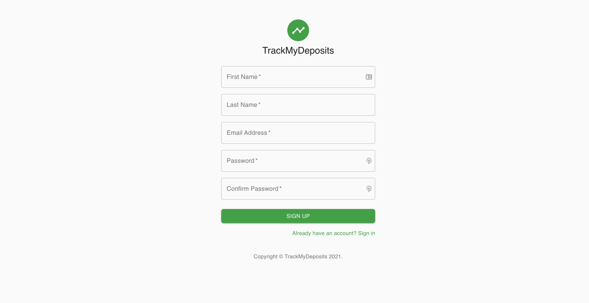
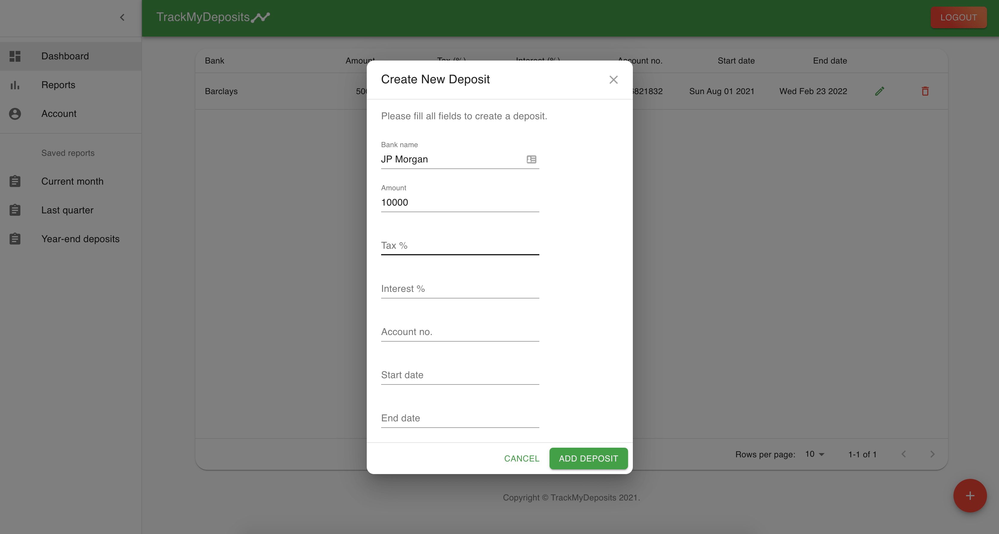
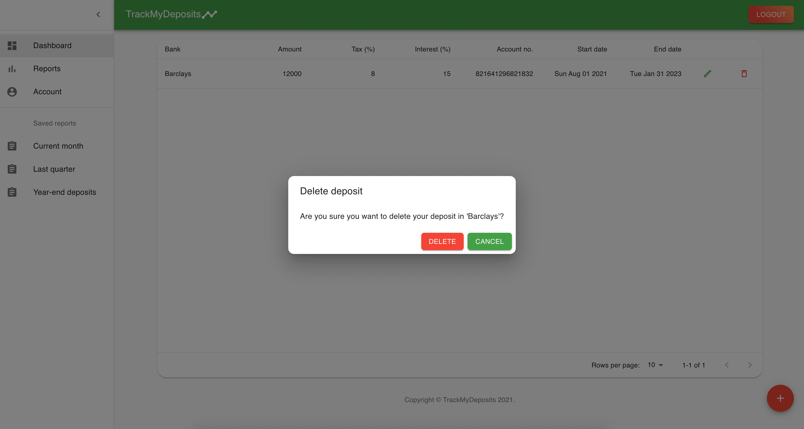
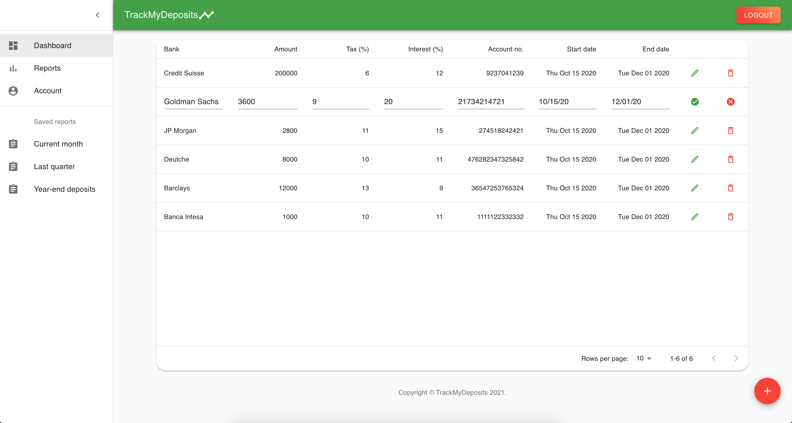
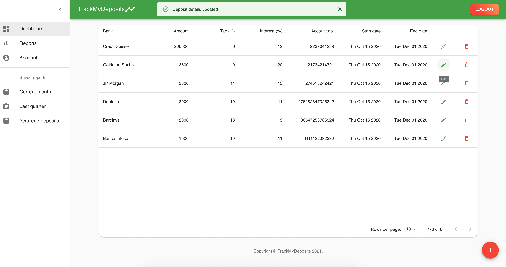
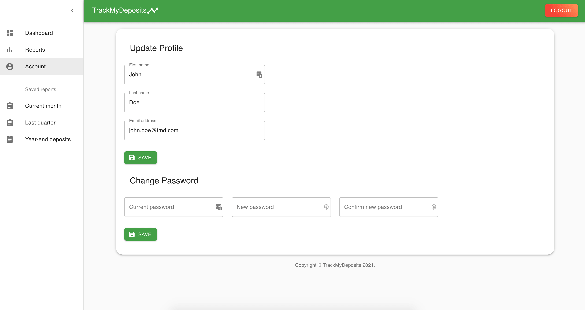
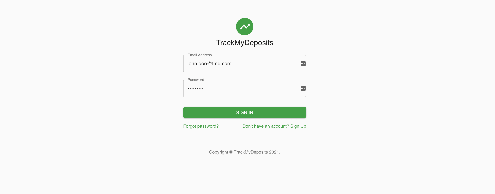

 

# React + Redux + Typescript ( The recommended way )

_This project will help you learn how to build a modern front end application with React, Redux and Typescript. It's purpose is to help anyone starting their software development journey or Junior developers sail into the Medior seas._

_What you will learn in this project:_

**React**  
**Redux**  
**Typescript**  
**React Router**  
**yup**  
**Formik**  
**Material UI**  
**axios**  
**eslint**

 

 

### This architecture template will be featured on https://infinitumcoders.com where you can find a detailed, tutorial-like, documentation for this and other projects.

### 🚨 Go to [_Infinitum Coders_](https://infinitumcoders.com) and subscribe to get the latest alerts for this and other featured projects. 🚨

 

 
 
## Table of content from the documentation:

-   Setup project using `create-react-app` and `tsconfig.json`
-   _React_'s functional components with _Typescript_
-   Configure _Redux store_ with _Redux Toolkit_
-   _Redux_ actions and action creators
-   _Redux_ middlewares
-   _React Router_ for page routing
-   Build forms using _Formik_ (both with `<Formik />` component and with `useFormik` hook)
-   Use _yup_ for form validation
-   Build custom forms with multiple submit buttons
-   Style components with _Material UI_
-   Create custom data tables
-   Setup services for your APIs

 

🚧 We will be acceptind pull requests and updating the project in the future, so please share your thoughts, suggestions and wishes on [_Infinitum Coders_](https://infinitumcoders.com) and we'll try to get those updates ASAP.

👉 If there are any Software Engineering Veterans out there looking at this, your impressions are more than welcome!

 

Thanks for reading and happy coding!

 

 

Some screenshots from the app:

 

 

 

 

 

 

 

